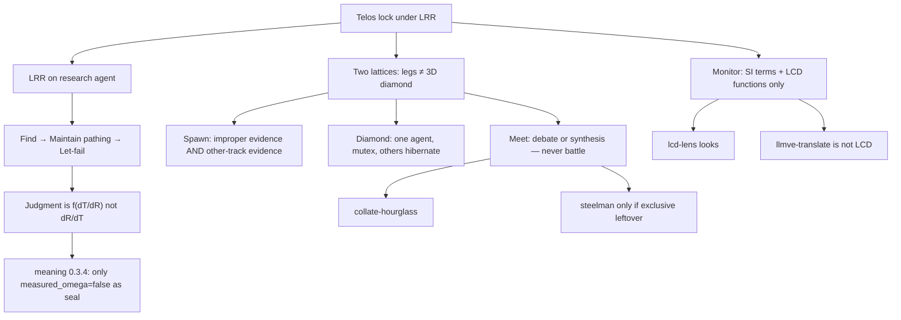
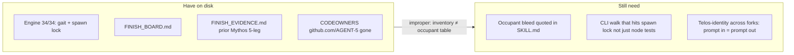
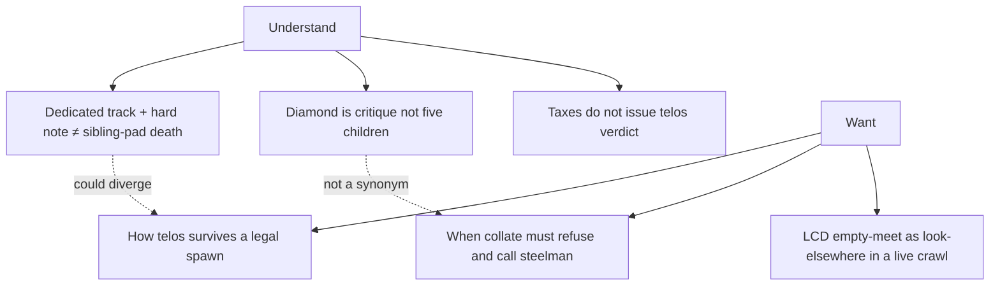
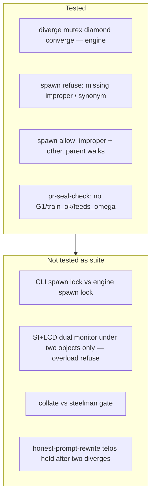

# Five-ahead lattices

Agent Five = this session (login Jadon-Fox). Pack only.  
`measured_omega=false` · no invent-green  
Not Ω. Not Mythos recrawl. Not orch/sensors.

Telos of the **pack**: a methodology so an agent stays locked on **telos** under Logic · Ration · Reason, by **branching** when a track is improper *and* another track is evidenced, and **converging** by debate or synthesis.

## Already converged (thread → pack)

These are not open fights. Do not spawn synonym legs.

Empty meets **already named** (ore, stay empty): Conley shape ≠ Mythos-in-W; MDL ≠ \(e^{\sigma_{sub}}\); greedy/top-p ≠ \(P_L\); attach-seed ≠ this pack.

## Lattice A — evidence

## Lattice B — research (understand vs want)

## Lattice C — tests

## Five steps ahead (legal next diverges)

Do **not** run all five at once. Each is a spawn only if the current track is improper **and** the other track is quoted.

| Step | Track | Improper if… | Other-track evidence | Converge as |
|---|---|---|---|---|
| 1 | Morph occupant bleed | FINISH_BOARD: rewrite restates laws; lattice/twin/steelman all claim meet | Quote SKILL.md collisions | **landed** — one occupant per named skill |
| 2 | CLI spawn-lock probe | Engine gate can pass while CLI still clones on any cannotFollow | Quote `run-apparatus.md` vs `assertLegalSpawnNote` | Same lock on CLI gait, or empty meet named |
| 3 | Telos-hold across forks | Spawn can keep LRR local and drop the working telos | Rewrite → diverge twice → restatement still names original telos | Identity held or SI redirect |
| 4 | Collate vs steelman | Meet defaults to tournament | Exclusive leftover after collate only | Steelman gated |
| 5 | LCD look-elsewhere live | Monitor converts empty meet into help/translate | A page with collection ∩ demand empty | Redirect, not convert |

**HOLD behind these:** `llmve-factor-compute`, Mythos=Conley, Ω, twin-on-same-charge, orch/sensors.

## How to use this file

Scout stays on **telos lock**. When a step’s improper+other both exist, `diverge()`. Diamond one restatement at a time. Collate. Do not mint.

If you only run one: **step 1** (occupant bleed) — FINISH_BOARD already marked Morph, not Keep.
