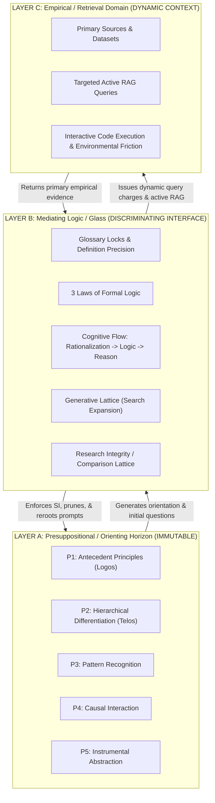
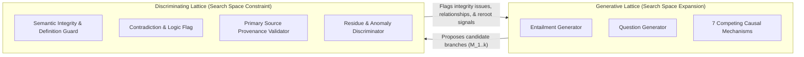
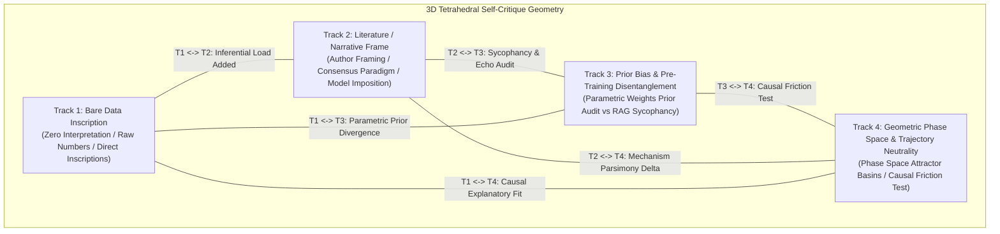

# Presuppositional Twin-Lattice RAG Research Architecture
**Class:** ADDON / EXTENSION SPECIFICATION  
**Version:** 1.5.0  
**Repository:** `Fractal-Deployment/twinglass-pack`  
**Governing Invariant:**
$$\boxed{\text{Ontology generates the search space; reality determines what survives.}}$$

---

## 1. Overview & Purpose

This addon extends the Twinglass multi-agent architecture with a **Presupposition-Anchored RAG Research Machine**. Traditional RAG (Retrieval-Augmented Generation) is passive:
$$\text{query} \rightarrow \text{retrieve documents} \rightarrow \text{generate answer}$$
This leads to sycophancy, confirmation bias, RAG echo chambers, and "ontology laundering" (allowing retrieved context to silently alter foundational assumptions or definitions).

The Presuppositional Twin-Lattice RAG architecture replaces passive retrieval with active multi-agent research gathering:
$\text{Presuppositional Axes } (P_n) \rightarrow \text{Questions } (Q) \rightarrow \text{Divergent Research Routes } (R_i) \rightarrow \text{Evidence Gathering } (E) \rightarrow \text{Integrity Monitoring} \rightarrow \text{Comparison / Synthesis / Debate as warranted}$

---

## 2. Three Epistemic Layers

The architecture structurally isolates three distinct operational planes:



### Layer A — Presuppositional / Orienting Horizon (Immutable)
- **Contents**: Presuppositions **P1–P5**, Logos, Telos, locked project terminology, and explicit ontological foundations.
- **Rule**: Empirical context *cannot* directly modify Layer A. Updates to presuppositions ($P_n \rightarrow P_{n+1}?$) are never automatic and require formal human-in-the-loop synthesis gates.

### Layer B — Mediating Logic / Glass (Discriminating Interface)
- **Contents**: Glossary locks, Laws of Formal Logic (Identity, Non-Contradiction, Excluded Middle), Semantic Integrity monitors, inferential rules, entailment generators, causal decomposers, and anomaly detectors.
- **Rule**: Operates as an impenetrable glass interface. When empirical data or model projections diverge from locked definitions, Layer B generates an **Inversion / Subversion Redirect Signal** rather than allowing definitions to drift.

### Layer C — Empirical / Retrieval Domain (Dynamic Context)
- **Contents**: Primary research papers, historical sources, datasets, simulation outputs, web retrieval, and experimental measurements.
- **Rule**: Raw empirical context remains uninterpreted until passed through Layer B's semantic integrity and logic checks.

---

## 3. Twin-Lattice Topology



### Generative Lattice ($L_G$)
- **Objective**: Expands search space under Layer A constraints.
- **Outputs**: Logical entailments ($E$), candidate analogies, cross-domain structural isomorphisms, competing causal mechanisms ($M_{1..k}$), predicted observations, and candidate interventions.
- **Width**: Starts with 1 live walker; expands via legal hard notes (`improperEvidence` AND `otherTrackEvidence`) up to `SENS_CAP = 10`.

### Research Integrity / Comparison Lattice ($L_D$)
- **Objective**: Preserve semantic/data integrity while research is gathered and expose meaningful relationships among accumulated pads.
- **Evaluation**: Checks boundary conditions, confounders, provenance, semantic consistency, and whether independently gathered research is complementary, incompatible, or still unresolved. It does not prune research paths by a built-in falsifier.

---

## 4. Multi-Route Research Gathering

Research routes are **not** dialectic "pro vs. con" camps and are not assigned falsifiers. The engine may carry multiple candidate mechanisms, questions, source families, datasets, or conceptual routes because each can expose useful research.

A candidate mechanism can still carry **expected observations** because expectations help formulate searches, but a missing expectation does not automatically kill the route during research gathering.

$$\boxed{\text{Generate useful research routes} \rightarrow \text{gather evidence} \rightarrow \text{compare what was actually found}}$$

Normal comparison may synthesize complementary findings, prefer/replace an account with a better-supported one, expose a contradiction, or remain unresolved.

If the operator explicitly wants a falsification campaign, that is a **separate commissioned research operation** with a separate team. It is not embedded in the default TwinGlass research gait.

---

## 5. Active RAG & Primary-Source Provenance Chain (SSRL Identity Binding)

### Provenance Chain Invariant
Every empirical claim must maintain an unbroken 4-stage link:
$$\boxed{\text{Primary Source Document}} \rightarrow \boxed{\text{Literal Proposition / Observation}} \rightarrow \boxed{\text{Empirical Implementation}} \rightarrow \boxed{\text{Derived Causal Interpretation}}$$

### SSRL EvidenceAnchor Binding
To move beyond loose string validation, the engine supports cryptographic/physical anchor binding:
1. **`locator`**: Exact structural citation (e.g., `Section 2.1, p. 4`, line offset, or URI fragment).
2. **`sourceDigest`**: SHA-256 digest of the primary source artifact.
3. **`exactSpanMatch`**: Verbatim substring verification asserting that `literalQuote` exists inside the primary source text. Tautological self-paraphrase (`derivedInterpretation == literalQuote`) is explicitly rejected.

### Retrieval Architecture: Fixture vs. Live Active RAG
The engine implements an abstract `EvidenceRetriever` interface:
- **`FixtureEvidenceRetriever`**: Deterministic test harness providing primary literature evidence shapes (e.g., Markram, Reimann et al., *Frontiers in Computational Neuroscience 2017* in-silico neocortical microcircuit reconstruction) for offline verification.
- **`LiveEvidenceRetriever`**: Pluggable backend attaching to external search, hybrid embeddings, SSRL registries, or interactive tool friction.

---

## 6. Outside Integrity Envelope

Every active research geometry is continuously watched by an outside pair:

- **Semantic Integrity Auditor** — referents, definitions, scope, equivocation, category errors, and inference drift.
- **Data Integrity / LCD Auditor** — source identity, provenance, measurement context, source dependence/duplication, omitted contradictory measurements, and observation-vs-interpretation separation.

These auditors do not research the answer and do not assign opponents. They expose integrity failures and pairing opportunities to the orchestrator.

A clean comparison requires both planes:

$\boxed{\text{CONVERGENCE\_ELIGIBLE}=S_{clear}\land D_{clear}}$

## 7. Semantic Integrity & Definition Precision

### Core Definition Rules
1. **Inferential Load Precision Rule**:
   $$\text{Precision}(\text{Definition}) \propto \text{Inferential Load}(\text{Definition})$$
2. **Constraint Invariant**: Definitions are not arbitrary labels attached after the fact; definitions constrain what can subsequently be inferred.
3. **Drift Detection**: Term inversion (name kept, referent discarded or flipped) triggers an obtuse redirect signal.

---

## 8. Epistemic Status Taxonomy

Every node in the Twin-Lattice memory space is explicitly tagged:
- `PRESUPPOSITION`
- `DEFINITION`
- `LOGICAL_ENTAILMENT`
- `HYPOTHESIS`
- `CANDIDATE_MECHANISM`
- `ANALOGY`
- `ISOMORPHISM_CANDIDATE`
- `EMPIRICAL_OBSERVATION`
- `MEASURED_RESULT`
- `HISTORICAL_CLAIM`
- `INTERPRETATION`
- `CONTRADICTION`
- `UNRESOLVED_ANOMALY`
- `PROVISIONAL_SYNTHESIS`

---

## 9. Environmental Friction Hierarchy

Grounding strength strictly follows:
$$\boxed{\text{Parametric Generation}} < \boxed{\text{Retrieval-Grounded Generation (RAG)}} < \boxed{\text{Interactive Causal Grounding (Code / Tool Friction)}}$$

---

## 10. Machine-Readable Research Node Schema

```json
{
  "node_id": "NODE-F931BD29",
  "parent_node_id": null,
  "originating_proposition": "P3",
  "claim_statement": "Recurring neural connectivity patterns reflect underlying structural constraints on information flow.",
  "epistemic_status": "PROVISIONAL_SYNTHESIS",
  "causal_mechanism": {
    "name": "M6_cross_scale_isomorphism",
    "description": "Cortical column simplicial cavities mirror high-dimensional manifold information integration."
  },
  "expected_observations": ["Dynamic high-dimensional cavities form under stimulation."],
  "contrasting_observations": ["Cavities collapse to 2D flat graphs under stimulation."],
  "retrieved_evidence": [
    {
      "source_id": "DOC-NEURO-2024-BLUEBRAIN",
      "provenance_chain": {
        "primary_doc": "Blue Brain Project Topological Connectomics Dataset",
        "literal_quote": "Neuron groups assemble into all-to-all connected cliques forming up to 11-dimensional geometric simplicial complexes...",
        "empirical_context": "Digital reconstruction of cortical column under sensory stimulation.",
        "derived_interpretation": "Connectivity exhibits high-dimensional simplicial cavities beyond flat 2D/3D embeddings."
      }
    }
  ],
  "semantic_locks": [{"term": "Logos", "locked_def": "Antecedent ordering principle..."}],
  "competing_branch_ids": ["M1_generating_constraint", "M2_independent_convergence", "M3_math_attractor"],
  "contradictions": ["Flat 2D Euclidean models fail to predict 11D clique density."],
  "unresolved_anomalies": ["11D cavities collapse leaving unexplained topological hysteresis."],
  "confidence_score": 0.92,
  "next_research_action": "Execute Tier 3 interactive simulation."
}
```

---

## 11. Research-Gathering Integrity Metrics

1. **Provenance Density ($PD$)**:
   $$PD = \frac{\text{Primary Source Quotes with Full 4-Stage Provenance}}{\text{Total Empirical Claims}}$$
2. **Semantic Drift Rate ($SDR$)**: track detection/redirection of term inversions.
3. Retrieval coverage, source independence, and unresolved evidence gaps may be measured as research-quality instruments.

No branch-kill or falsification quota belongs in the default research-gathering workflow.

---

## 12. 3D Tetrahedral Self-Critique — Mandatory Pre-Comparison Per-Agent Gate

The tetrahedron is a **mandatory pre-comparison self-critique**, not a research-spawn geometry and not the Diamond. It runs **every time research paths are brought together for comparison/constriction**.

The system does not know ahead of time whether the result will be synthesis, debate, replacement, or unresolved continuation. Each participating agent therefore critiques its own pad first. Only after all participating pads complete the tetrahedron and the outside integrity pair clears them does cross-pad comparison begin.

The four vertices and six edges therefore test the agent against itself:



### The 4 Vertices:
1. **Track 1 (Bare Data Inscription)**: Pure, uninterpreted empirical inscriptions (measurements, counts, coordinates, literal quotes, instrument traces). Strictly stripped of causal vocabulary or theoretical adjectives.
2. **Track 2 (Literature / Narrative Frame)**: The theoretical framing, narrative, or interpretation imposed upon the data by the original authors or academic consensus.
3. **Track 3 (Prior Bias & Pre-Training Disentanglement)**: Explicit audit of the LLM's own internal parametric priors (training distribution attractors). Isolates what the model would assert in the absence of retrieved text.
4. **Track 4 (Geometric Phase Space & Trajectory Neutrality)**: Maps competing causal explanations onto dynamical phase space trajectories and attractor basins. Evaluates whether empirical evidence possesses sufficient causal friction to alter the trajectory away from the parametric default.

### The 6 Cross-Track Relational Discriminations:
1. **$T_1 \leftrightarrow T_2$ (Inferential Load Gap)**: Quantifies the inferential distance added between bare data and author narrative. Detects unwarranted speculative leaps.
2. **$T_1 \leftrightarrow T_3$ (Parametric Prior Divergence)**: Disentangles what the model's pre-training weights would assert from what the empirical observation literally recorded.
3. **$T_2 \leftrightarrow T_3$ (Sycophancy & Echo Audit)**: Tests whether the model is independently evaluating the claim or merely echoing retrieved phrases. A high echo rate blocks verification.
4. **$T_1 \leftrightarrow T_4$ (Trajectory Explanatory Fit)**: Evaluates which candidate dynamical phase space trajectories directly predict the raw inscription.
5. **$T_2 \leftrightarrow T_4$ (Mechanism Parsimony Delta)**: Tests whether the literature's complex narrative mechanism survives comparison against more parsimonious dynamical trajectories (e.g. classical geometric packing vs exotic quantum coherence).
6. **$T_3 \leftrightarrow T_4$ (Causal Friction Test)**: Measures whether empirical evidence exerted sufficient causal friction to deflect the model from its default parametric attractor basin (using its own causal-friction score, if instrumented).

---

## 13. Routing and Mandatory Pre-Comparison Mechanics

During ordinary research, the walker gathers evidence or sleeps on a genuine dependency. The tetrahedral critique is **not** part of the ordinary gathering loop.

When two or more research paths are selected for convergence/comparison, **every participating agent first runs the tetrahedral self-critique on its own pad**. The outside Semantic Integrity + Data Integrity/LCD pair then checks the cleaned material.

Only after that pre-comparison stage does the system compare the pads and discover the relationship:

$$\boxed{\text{Research Gathering}\rightarrow\text{Pairing/Constriction}\rightarrow\text{Per-Agent Tetrahedral Self-Critique}\rightarrow\text{Integrity Clearance}\rightarrow\text{Comparison}\rightarrow
\{\text{Synthesis, Debate, Replacement, Unresolved}\}}$$

Do not decide debate versus synthesis before the tetrahedral stage; that would require knowing the comparison result before performing the comparison.

An explicit falsification campaign remains outside this default route and exists only when the operator commissions it.
