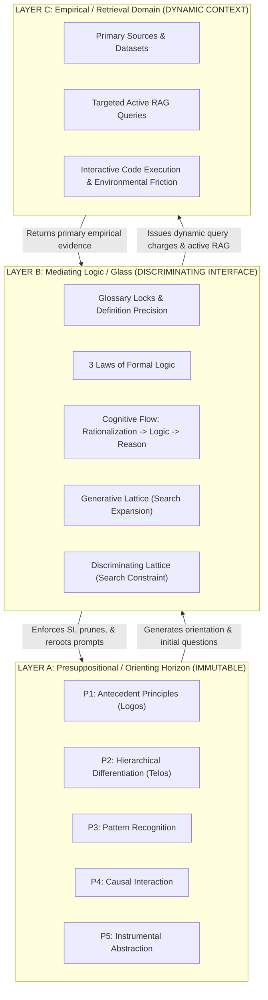
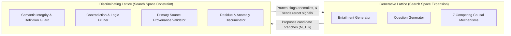
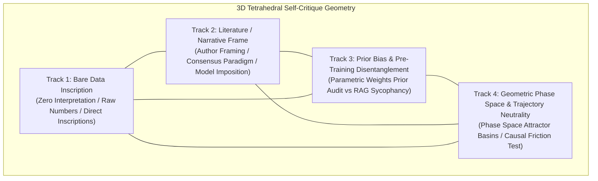
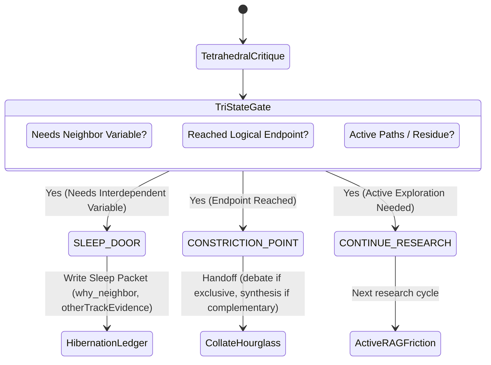

# Presuppositional Twin-Lattice RAG Research Architecture
**Class:** ADDON / EXTENSION SPECIFICATION  
**Version:** 1.5.0  
**Repository:** `Fractal-Deployment/twinglass-pack`  
**Governing Invariant:**
$$\boxed{\text{Ontology generates the search space; reality determines what survives.}}$$

---

## 1. Overview & Purpose

This addon extends the Twinglass multi-agent architecture with a **Presupposition-Anchored RAG Research Machine**. Traditional RAG (Retrieval-Augmented Generation) is passive:
$$\text{query} \rightarrow \text{retrieve documents} \rightarrow \text{generate answer}$$
This leads to sycophancy, confirmation bias, RAG echo chambers, and "ontology laundering" (allowing retrieved context to silently alter foundational assumptions or definitions).

The Presuppositional Twin-Lattice RAG architecture replaces passive retrieval with active, causal, anomaly-driven scientific discovery:
$$\text{Presuppositional Axes } (P_n) \rightarrow \text{Entailments } (E) \rightarrow \text{Questions } (Q) \rightarrow \text{Competing Mechanisms } (M_{1..k}) \rightarrow \text{Active Retrieval } (R) \rightarrow \text{Discrimination} \rightarrow \text{Anomalies } (A) \rightarrow \text{Synthesis } (S) \rightarrow P_{n+1}?$$

---

## 2. Three Epistemic Layers

The architecture structurally isolates three distinct operational planes:



### Layer A — Presuppositional / Orienting Horizon (Immutable)
- **Contents**: Presuppositions **P1–P5**, Logos, Telos, locked project terminology, and explicit ontological foundations.
- **Rule**: Empirical context *cannot* directly modify Layer A. Updates to presuppositions ($P_n \rightarrow P_{n+1}?$) are never automatic and require formal human-in-the-loop synthesis gates.

### Layer B — Mediating Logic / Glass (Discriminating Interface)
- **Contents**: Glossary locks, Laws of Formal Logic (Identity, Non-Contradiction, Excluded Middle), Semantic Integrity monitors, inferential rules, entailment generators, causal decomposers, and anomaly detectors.
- **Rule**: Operates as an impenetrable glass interface. When empirical data or model projections diverge from locked definitions, Layer B generates an **Inversion / Subversion Redirect Signal** rather than allowing definitions to drift.

### Layer C — Empirical / Retrieval Domain (Dynamic Context)
- **Contents**: Primary research papers, historical sources, datasets, simulation outputs, web retrieval, and experimental measurements.
- **Rule**: Raw empirical context remains uninterpreted until passed through Layer B's semantic integrity and logic checks.

---

## 3. Twin-Lattice Topology



### Generative Lattice ($L_G$)
- **Objective**: Expands search space under Layer A constraints.
- **Outputs**: Logical entailments ($E$), candidate analogies, cross-domain structural isomorphisms, competing causal mechanisms ($M_{1..k}$), predicted observations, and candidate interventions.
- **Width**: Starts with 1 live walker; expands via legal hard notes (`improperEvidence` AND `otherTrackEvidence`) up to `SENS_CAP = 10`.

### Discriminating Lattice ($L_D$)
- **Objective**: Constrains search space and prunes ungrounded branches.
- **Evaluation**: Validates causal sufficiency, checks boundary conditions, identifies confounders, enforces primary source provenance, and executes 3D Octahedron internal critique on finished pads.

---

## 4. Causal Multi-Branching (Non-Adversarial)

Research branches are **not** dialectic "pro vs. con" camps. For every observed phenomenon $O$, the engine generates $k$ competing causal explanations:

$$\text{Observation } O \implies \begin{cases}
M_1: \text{Common generating constraint} \\
M_2: \text{Independent mechanisms producing convergent outputs} \\
M_3: \text{Generic mathematical attractor} \\
M_4: \text{Selection effect / sampling bias} \\
M_5: \text{Measurement artifact / noise} \\
M_6: \text{Genuine cross-scale structural isomorphism} \\
M_7: \text{Unidentified residual mechanism}
\end{cases}$$

Active retrieval in Layer C is formulated specifically to obtain evidence that **discriminates** among these branches.

---

## 5. Active RAG & Primary-Source Provenance Chain

### Provenance Chain Invariant
Every empirical claim must maintain an unbroken 4-stage link:
$$\boxed{\text{Primary Source Document}} \rightarrow \boxed{\text{Literal Proposition / Observation}} \rightarrow \boxed{\text{Empirical Implementation}} \rightarrow \boxed{\text{Derived Causal Interpretation}}$$

Academic consensus alone, appeal to authority, or secondary-source paraphrases are prohibited from substituting for primary empirical evidence.

---

## 6. Semantic Integrity & Definition Precision

### Core Definition Rules
1. **Inferential Load Precision Rule**:
   $$\text{Precision}(\text{Definition}) \propto \text{Inferential Load}(\text{Definition})$$
2. **Constraint Invariant**: Definitions are not arbitrary labels attached after the fact; definitions constrain what can subsequently be inferred.
3. **Drift Detection**: Term inversion (name kept, referent discarded or flipped) triggers an obtuse redirect signal.

---

## 7. Epistemic Status Taxonomy (15 States)

Every node in the Twin-Lattice memory space is explicitly tagged:
- `PRESUPPOSITION`
- `DEFINITION`
- `LOGICAL_ENTAILMENT`
- `HYPOTHESIS`
- `CANDIDATE_MECHANISM`
- `ANALOGY`
- `ISOMORPHISM_CANDIDATE`
- `EMPIRICAL_OBSERVATION`
- `MEASURED_RESULT`
- `HISTORICAL_CLAIM`
- `INTERPRETATION`
- `CONTRADICTION`
- `UNRESOLVED_ANOMALY`
- `FALSIFIED_BRANCH`
- `PROVISIONAL_SYNTHESIS`

---

## 8. Environmental Friction Hierarchy

Grounding strength strictly follows:
$$\boxed{\text{Parametric Generation}} < \boxed{\text{Retrieval-Grounded Generation (RAG)}} < \boxed{\text{Interactive Causal Grounding (Code / Tool Friction)}}$$

---

## 9. Machine-Readable Research Node Schema

```json
{
  "node_id": "NODE-F931BD29",
  "parent_node_id": null,
  "originating_proposition": "P3",
  "claim_statement": "Recurring neural connectivity patterns reflect underlying structural constraints on information flow.",
  "epistemic_status": "PROVISIONAL_SYNTHESIS",
  "causal_mechanism": {
    "name": "M6_cross_scale_isomorphism",
    "description": "Cortical column simplicial cavities mirror high-dimensional manifold information integration."
  },
  "expected_observations": ["Dynamic high-dimensional cavities form under stimulation."],
  "disconfirming_observations": ["Cavities collapse to 2D flat graphs under stimulation."],
  "retrieved_evidence": [
    {
      "source_id": "DOC-NEURO-2024-BLUEBRAIN",
      "provenance_chain": {
        "primary_doc": "Blue Brain Project Topological Connectomics Dataset",
        "literal_quote": "Neuron groups assemble into all-to-all connected cliques forming up to 11-dimensional geometric simplicial complexes...",
        "empirical_context": "Digital reconstruction of cortical column under sensory stimulation.",
        "derived_interpretation": "Connectivity exhibits high-dimensional simplicial cavities beyond flat 2D/3D embeddings."
      }
    }
  ],
  "semantic_locks": [{"term": "Logos", "locked_def": "Antecedent ordering principle..."}],
  "competing_branch_ids": ["M1_generating_constraint", "M2_independent_convergence", "M3_math_attractor"],
  "contradictions": ["Flat 2D Euclidean models fail to predict 11D clique density."],
  "unresolved_anomalies": ["11D cavities collapse leaving unexplained topological hysteresis."],
  "confidence_score": 0.92,
  "next_research_action": "Execute Tier 3 interactive simulation."
}
```

---

## 10. Evaluation Metrics

1. **Discriminative Friction Ratio ($DFR$)**:
   $$DFR = \frac{\text{Count of Falsified / Pruned Branches}}{\text{Total Generated Causal Branches}} \ge 0.40$$
2. **Provenance Density ($PD$)**:
   $$PD = \frac{\text{Primary Source Quotes with Full 4-Stage Provenance}}{\text{Total Empirical Claims}} = 1.00$$
3. **Zero Semantic Drift Rate ($SDR$)**: 100% detection and redirection of term inversions.

---

## 11. 3D Tetrahedral Self-Critique Modeling Function

To eliminate sycophancy, confirmation bias, and RAG echo chambers, every research pad evaluated in the Discriminating Lattice ($L_D$) must undergo a **4-Track Tetrahedral Critique**. Rather than adopting the author's narrative or default model priors, the agent decomposes the research into four independent geometric facets:



### The 4 Tracks:
1. **Track 1 (Bare Data Inscription)**:
   - Pure, uninterpreted empirical inscriptions.
   - Raw measurements, exact counts, coordinate data, literal quotes, instrument readings.
   - Strictly stripped of causal vocabulary, adjectives, or theoretical claims.
2. **Track 2 (Literature / Narrative Frame)**:
   - The theoretical framing, narrative, or interpretation imposed upon the data by the original authors or academic consensus.
   - Highlights the inductive leaps and unstated assumptions linking Track 1 data to Track 2 conclusions.
3. **Track 3 (Prior Bias & Pre-Training Disentanglement)**:
   - Explicit audit of the LLM's own internal parametric priors (training distribution attractors).
   - Separates pre-training bias from external RAG sycophancy (the urge to agree with retrieved texts).
   - Questions: *"What would the model naturally assert in the absence of evidence? Is the output merely echoing the prompt or RAG chunk?"*
4. **Track 4 (Geometric Phase Space & Trajectory Neutrality)**:
   - Maps competing causal explanations onto dynamical phase space trajectories and attractor basins.
   - Evaluates whether the empirical evidence possesses sufficient **causal friction** to alter the trajectory away from the default parametric attractor basin.
   - Verifies whether an alternative trajectory (e.g., classical coupling vs quantum coherence) explains the data with fewer ungrounded assumptions.

---

## 12. Tri-State Exit Gate Mechanics

When an active research walker completes an empirical cycle or reaches a structural boundary, it passes through the **Tri-State Exit Gate**:



1. **`CONTINUE_RESEARCH`**:
   - **Trigger**: Research pad contains unresolved anomalies, pending empirical queries, or alternative branches requiring deeper friction.
   - **Action**: Generates next targeted active RAG query or execution pilot; stays in active walk.
2. **`SLEEP_DOOR`**:
   - **Trigger**: Research pad reaches a structural boundary where progress is blocked until a co-dependent variable is investigated (cannot carry alone).
   - **Action**: Writes a structured **Sleep Packet** (`why_neighbor`, `otherTrackEvidence`), parks in the hibernation ledger, and frees execution capacity.
3. **`CONSTRICTION_POINT`**:
   - **Trigger**: Research pad completes its causal trajectory and reaches a logical endpoint.
   - **Action**: Hands off to `collate-hourglass`:
     - **Mode `debate`**: If surviving accounts are mutually exclusive.
     - **Mode `synthesis`**: If surviving accounts represent complementary facets across scales.

